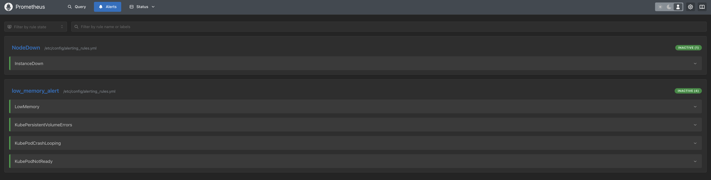
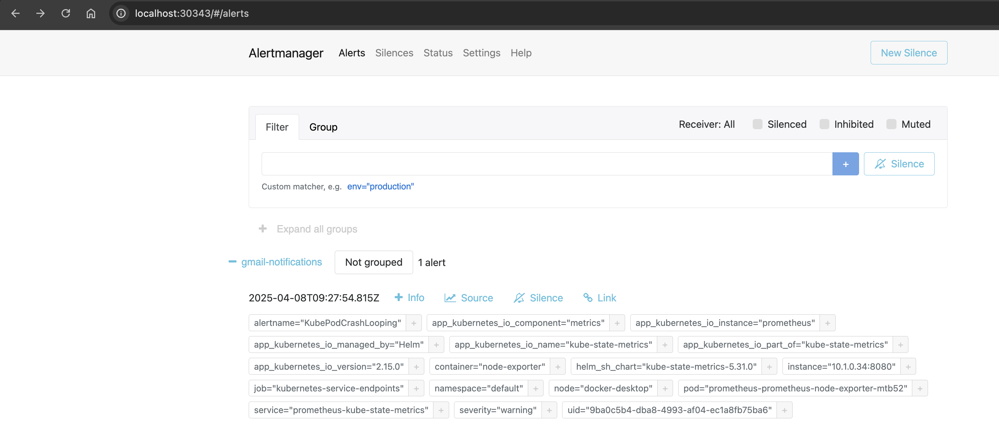
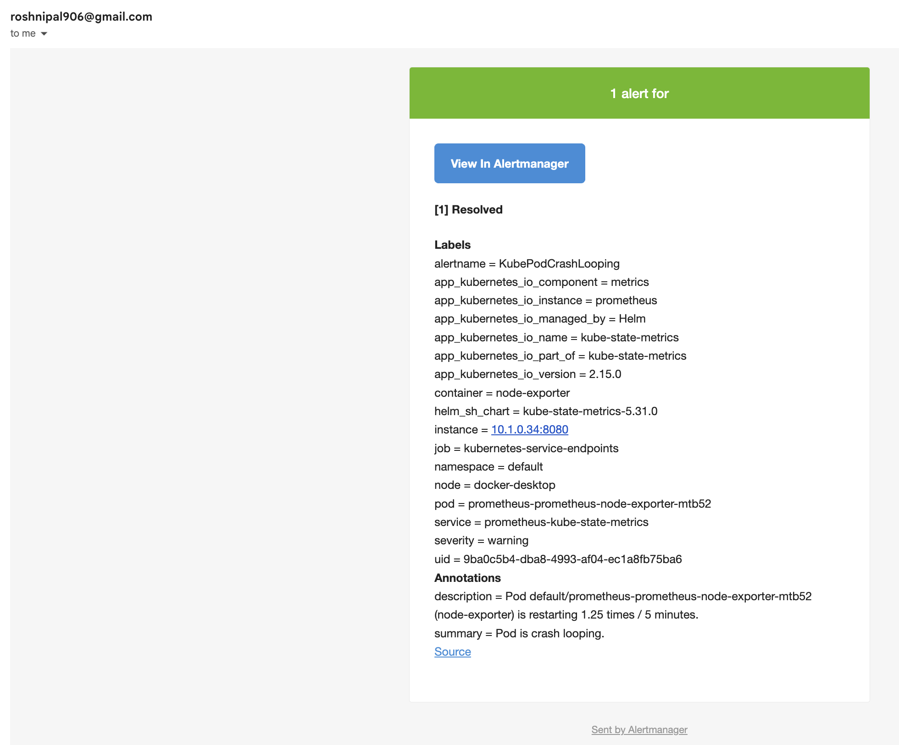
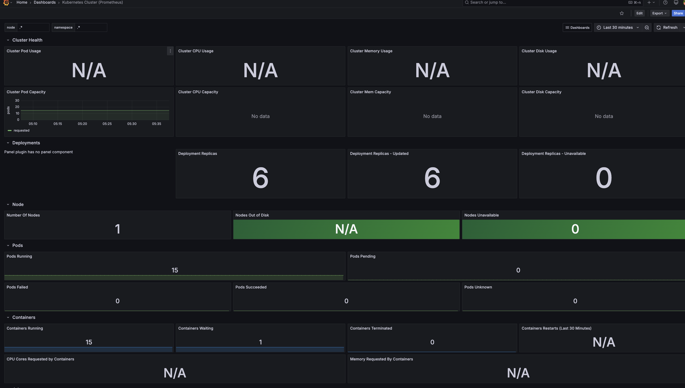

# 🚨 Alertmanager + Prometheus + Grafana Setup in Kubernetes (for Data Engineers)

This project helps you set up a complete **monitoring and alerting system** using:

- [Prometheus](https://prometheus.io/)
- [Alertmanager](https://prometheus.io/docs/alerting/latest/alertmanager/)
- [Grafana](https://grafana.com/)
- [Kubernetes (via Docker Desktop)](https://www.docker.com/products/docker-desktop)

It’s designed especially for **Data Engineers** who want to:
- Monitor CPU and memory usage of data pipeline components (e.g., Spark, Kafka, Airflow)
- Get real-time email alerts when pods crash or restart
- Visualize metrics and health of their Kubernetes cluster

## 📖 Blog Post

📝 For a full step-by-step guide with explanations and visuals, check out my article:  
👉 [**Monitoring Pipelines with Prometheus, Grafana & Kubernetes in Docker**](https://medium.com/@palroshni43/monitoring-pipelines-with-prometheus-grafana-kubernetes-in-docker-7e0b1a61c618)


---

## 🧰 Prerequisites

- Docker Desktop (with Kubernetes enabled)
- `kubectl` CLI
- [Helm 3](https://helm.sh/docs/intro/install/)
- Gmail App Password (for sending alert emails)

---

### 1️⃣ Install Helm

```bash
curl -fsSL -o get_helm.sh https://raw.githubusercontent.com/helm/helm/main/scripts/get-helm-3
chmod 700 get_helm.sh
./get_helm.sh
```
### 2️⃣ Add Prometheus Helm Repository
```
helm repo add prometheus-community https://prometheus-community.github.io/helm-charts
helm repo update
```
3️⃣ Install Prometheus & Alertmanager
```
helm install prometheus prometheus-community/prometheus -f prometheus.yaml
```
4️⃣ Access Prometheus UI

```
export POD_NAME=$(kubectl get pods -l "app.kubernetes.io/name=prometheus" -o jsonpath="{.items[0].metadata.name}")
kubectl port-forward $POD_NAME 9090
Open Prometheus: http://localhost:9090
```
5️⃣ Access Alertmanager UI

```
kubectl expose service prometheus-alertmanager --type=NodePort --target-port=9093 --name=alertmanager-access
```
6️⃣ Configure Email Alerts

Edit the Alertmanager config:
```
kubectl edit configmap prometheus-alertmanager
```
9️⃣ Access Grafana Dashboard


```
export POD_NAME=$(kubectl get pods -l "app.kubernetes.io/name=grafana" -o jsonpath="{.items[0].metadata.name}")
kubectl port-forward $POD_NAME 3000
```


